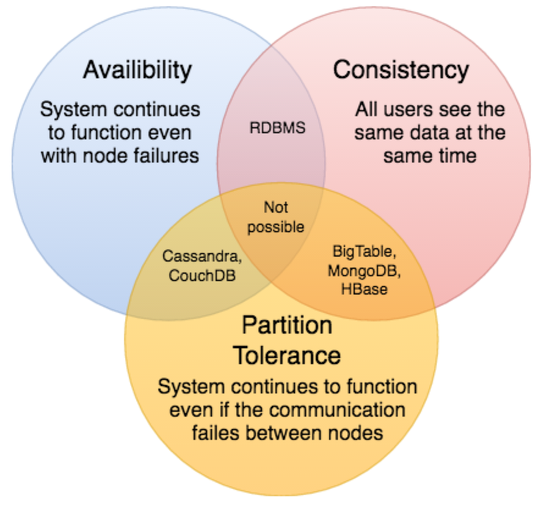

# SYS Design Basics
- __Need to consider these principles when designing a large scale system__
    1. What are the various architectural pieces to be used ?
    2. How do these prescribed pieces work with each other ?
    3. How can we best use these pieces: what are the correct tradeoffs ?
    - Forethought into design can save time, resources in future
        * Distributed System Concepts: Consistent Hashing, CAP Theorem, Load Balancing, Caching, Data Partitioning, Indexes, Proxies, Queues, Replication, and choosing between SQL vs. NoSQL

### Key Distributed System (DS) Characteristics
#### Scalability
- Capability of system, process, network to grow + manage increased demand -> any ds can evolve to support growing amount of work considered to be scalable
        * system may have to scale due to increase data volume, work (# of transactions) -> prefer to achieve this w/o performance loss
            - horizontal: scale by adding more servers into pool of resources (easier to scale dynamically)
            - vertical: add more power (cpu, ram, storage) to an existing server (involves downtime, upper limit)

#### Reliability
- Probability system fails in given period -> DS considered reliable if it keeps delivering services when 1+ software/hardware comps fail (one of main characteristics)
    * achieved through redundancy of software comps, data (has cost -> achieve service resilience with elimination of every possible point of failure)

#### Availability
- Time a system remains operational to perform req function in specified period -> simple measure of % of time a system, service, machine is operational under normal conditions
- Reliability = availability/time (considering range of real world events)
    * if a system is reliable, it is available v if it is available, does not directly mean its reliable

#### Efficiency
- Two std measures of sys efficiency are: (1) response time/latency - denotes delay to obtain first item and (2) throughput (bandwith) = # of items delivered in given time (second)

#### Serviceability / Manageability
- Simplicity + speed in which a system can be repaired / maintained -> if time to fix failed system increase, availability decreases
    * consider: ease of diagnosing + understanding problems when they occur + easy of updates/mods + how simple system is to operate

### Load Balancing
* critical comp to DS
    - aids in spreading traffic across server clusters to improve responsiveness, app + web + db availability
    - keep track of resources status while distributing requests
    - By balancing requests across several servers, LB mitigates indv. server load, prevent any one app server from being a central Point of Failure -> improve app availability + responsiveness
- Benefits
    * users gain faster, uninterrupted service
    *  less downtime + higher throughput
#### Load Balancing Algorithms
- How is the backend server chosen?
    * Two factors are considered: (1) ensure chosen server response appropriately to requests, (2) pre configured algo selects
        - health checks attempt to connect to be servers to ensure listening, if check is failed -> remove server from pool
        * Algorithms include: round robin, ip hash, least connection method, least response time, least bandwith
### Caching
* make better use of currently possessed resources + make unattainable product reqs feasible
    - take advantage of locality of reference principle: recently req data = likely to be req again
    - short term memory: limited amount of space but faster than original data source w/ recently accessed item
#### App Server Cache
- local storage of response data is enabled by placing cache on request layer node
    - each time req made to service, get from local cached data
    - if not in cache, req node queries data from disk
#### Content Distribution Network (CDN)
- cache that comes into play for sites that have large amts of static media
    * typical setup, req first ask cdn for piece of static media -> cdn serves content if locally available
        - if not available, query BE servers
#### Cache Invalidation
- Caching req maintenance for keeping it coherent w/ truth source -> if data mod in db, invalidate in cache to provide consistent app behavior
    * write through cache
        - data written on cache and db at same time -> fast retrieval, complete data consistency, nothing loss in failure event
            * higher latency for write ops
    * write around cache
        - reduce cache flood w/ write ops, but can result in cache miss, high latency
    * write back cache
        - data written to cache -> client with write to storage done under specific conditions/intervals
            * low latency, high throughput for write intense apps
            * comes w/ risk of data loss in crash, adverse event
#### Cache Eviction Policies
- Some: LRU - discard least recently used items first, LFU - const how often item is needed (least often are discarded first)
### Sharding / Data Partitioning
* DP (sharding) = technique to break db into several smaller partitions
    - performed on several machines to improve manageability, performance, availability, LB of app
    * cheaper + more feasible to scale horizontal via more machines
1. Partitioning Methods
    - Horizontal
        * put various rows in several tables -> (range based sharding - various data ranges)
        * Problem: if values whose range is used isn't carefully chosen, can result in unbalanced servers
    - Vertical
        * divide data to store tables related to x feature in own server -> straightforward, low app impact
            * additional growth + fts = further partitions across several servers
    - Directory Based
        * create lookup service that understands partitioning scheme
2. Partitioning Criteria
    - Key/Hash Based : apply hash function to key attributes of stored entity -> yields partition #
    - List : each partition assigned values list -> when we want to insert new record, view part containing key, store them
    - Round-robin : ensure uniform data distribution, with n partitions, i tuple assigned (i%n)
    - Composite : combine multiple schemes for new scheme
3. Sharding Problems - ops across several tables, rows aren't on same server
    - Joins/Denormalization: denormalize db so queries req joins can be done on single table -> now deal w/ perils of denormalization
    - Referential integrity: apps that req referential integrity on sharded dbs req to enforce it in app code -> run regular sql jobs
    - Rebalancing: req if no uniform data distribution, load on a shard -> either create more db shards, rebalance existing shards -> scheme changed + all existing data moved to new locations
### Indexes
* when db performance is not satisfactory -> creating index allows for faster search through table, find row of rows we want -> created using 1 or more cols of db table providing rapid random lookups, efficient access or ordered records
- Impact on write performance
    * additional keys may slow down data insertion + update + delete ops for table

### Proxies
* intermediate server between client + be server
    * proxy server: software/hardware acting as intermediary for reqs from client seeking resources from other servers
    * used to filter reqs, log reqs, transform reqs (add/remove headers, encrypt/decrypt, compress resource)
- Server Types
    * proxy can reside on local or remote server
        - Open: accessible by any user
            * anon (reveal server identity, no ip)
            * transparent (able to cache websites, ip)
        - rev proxy
            * retrieve resources on client from 1+ servers
### Redundancy + Replication
- Redundancy: duplication of critical comps/fxns of sys with intention of increasing system reliability (backup/fail safe/improve sys performance)
- Replication: Used in several DBMS w/ origin-remote relationship: origin (has update), remote(receive updates)

### SQL v NoSQL
* differ in way they are built, information stored, storage method
    - SQL
        * data in rows, cols + rows contain info about entity + each col contains separate data points
    - NoSQL
        * Key Value Stores: data stored in array of key value pairs -> key = attribute name linked to value (redis, dynamo)
        * Doc dbs: data stored in docs, docs grouped in collections (mdb)
        * Wide-col dbs: in columnar dbs, there are column families that are containers for rows (cassandra)
        * graph dbs: store data whose relations best rep as graph (neo4j, infinitegraph)
- Differences
    - Storage
    - Schema:
        * (sql) each record has fixed schema -> columns must be decided and chosen before data entry
            * each row has data for each column -> schema can be altered later, involves entire db
        * (nosql) dynamic schemas, columns can be added as desired, row doesn't have to contain data for each column
    - querying: sql (structured query language), unql (unstructured query language)
    - scaling: sql is vertically scale (expensive), nosql (horizontal scale)
    - Relational (acid compliant), nosq (base - performance + scalability)
- Which One To Use
    * Choose SQL:
        - need to ensure ACID compliance -> reduce anomalies + protect db integrity by prescribing how transactions interact with db
            - e-commerce + financial apps
        - data is unstructured, unchanging -> consistent size/growth, working with consistent data
    * Choose NoSQL:
        - store large data volumes w/ little to no structure -> no limits set on data types that are stored together + allow for addition of new types as req
        - make most of cloud computing + storage -> req data to be easily spread across servers for vertical scale
        - rapid development, nosql = useful for rapid dev
            * working on quick system iterations req frequent updates to data structure w/o severe downtime between versions
### CAP Theorem
- impossible for ds to provide >2 of following CAP guarantees: Consistency, Availability, Partition tolerance
    * C: all nodes see same data @ same time, update several nodes prior to further reads
    * A: every req gets resp on success/failure -> replicate data across various servers
    * P: sys continues to work despite message loss/partial failure -> can sustain any amount of network failure not resulting in entire network failure
        - 
- no system can be available, sequentially consistent, tolerant to any partition failure
    * consistent: all nodes need to seem same update set in same order
    - in network is parted: updates in one partition may not make it to other partitions before client reads from out of data partition after up to date one
        * solution: stop req from out of data partition, but service won't be 100% available
### Consistent Hashing
* Consistent hashing is a very useful strategy for distributed caching system and DHTs. It allows us to distribute data across a cluster in such a way that will minimize reorganization when nodes are added or removed. Hence, the caching system will be easier to scale up or scale down.
    - Method: when the hash table is resized (e.g. a new cache host is added to the system), only ‘k/n’ keys need to be remapped where ‘k’ is the total number of keys and ‘n’ is the total number of servers.
- How it Works
    * Here’s how consistent hashing works:
        1. Given a list of cache servers, hash them to integers in the range.
        2. To map a key to a server,
            - Hash it to a single integer.
            - Move clockwise on the ring until finding the first cache it encounters.
            - That cache is the one that contains the key. See animation below as an example: key1 maps to cache A; key2 maps to cache C.
### Long Polling v Websockets v Server Sent Events
Following are a sequence of events for regular HTTP request:
    1. The client opens a connection and requests data from the server.
    2. The server calculates the response.
    3. The server sends the response back to the client on the opened request.
- Ajax:
    * Polling is a standard technique used by the vast majority of AJAX applications. The basic idea is that the client repeatedly polls (or requests) a server for data. The client makes a request and waits for the server to respond with data. If no data is available, an empty response is returned.
- HTTP Long Polling:
    * This is a variation of the traditional polling technique that allows the server to push information to a client whenever the data is available. With Long-Polling, the client requests information from the server exactly as in normal polling, but with the expectation that the server may not respond immediately. That’s why this technique is sometimes referred to as a “Hanging GET”.
- WebSockets:
    * WebSocket provides Full duplex communication channels over a single TCP connection. It provides a persistent connection between a client and a server that both parties can use to start sending data at any time. The client establishes a WebSocket connection through a process known as the WebSocket handshake. If the process succeeds, then the server and client can exchange data in both directions at any time. The WebSocket protocol enables communication between a client and a server with lower overheads, facilitating real-time data transfer from and to the server. This is made possible by providing a standardized way for the server to send content to the browser without being asked by the client and allowing for messages to be passed back and forth while keeping the connection open. In this way, a two-way (bi-directional) ongoing conversation can take place between a client and a server.
