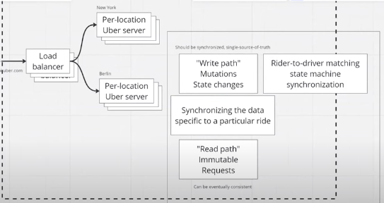

# [Uber SD](https://www.youtube.com/watch?v=wL-Gx5XE9XE)
## Write out system functional, non-functional reqs
* clarify question scope w/ interviewer (good at product first companies by diving into strong minutia/details)
    - else -> don't spend too long listing every req if not interviewing at product first company

### Functional Reqs
- Riders: book rides from a -> b (now v later)
- Drivers: drive riders from a -> b
    * rider actions - book ride, use gps + from provided point:
        1. set custom time, change ride mid way, cancel ride + before/mid
        2. different car types, number of people be picked up can be different
    * diver actions - provide ride:
        - mark self as driver, 'on hold'
            - 'I'm heading home' mode in order to avoid drivers from being penalized
            - consider 'automatic accept rides until T+2 hours/5PM'
        - start reception of 'bids'
            - receive pick up location, time 'now'
            - how long/far is ride planned to be, extra req metadata
            - prospective rider's rating
    * shared requirements:
        - rider + driver ratings
        - pickup/dropoff points

### Non-Functional
- Obj: Keep drivers busy
* __focus on rider <> driver matching problem__
- Matching Algo + UX
- Understand how process goes from right to left of above objective (life of a ride)

## How a ride progresses
1. Rider request
2. System starts looking for driver
3. FIND_A_DRIVER
    - IF driver who accepted ride is found, invoke `PICKUP()`
4. If instant book available -> (a) pick driver nearby -> (b) send ride request -> (c) if no explicit rejection, wait 4 sec then invoke `FIND_A_DRIVER()`
5. If instant book not available -> (a) pick driver nearby -> (b) send ride request -> (c) if no conformation, wait 7 sec then invoke `FIND_A_DRIVER()`

- PICKUP
    - location shared in real time, tweaked to allow for traffic lights + other traffic rules
- PICKUP_MODE()
    * Can cancel from either side, for potential fee
    * Once ride is confirmed go to IN_RIDE mode
        * confirmed includes gps, manual driver confirmation, code

## High Level Design
- LoadBalancer (lB) : Cluster denoted with multiple of lb instances
* request hits one instance of lb that enters private network as quickly as possible
    - means system needs to be low latency and high throughput ensuring reliability
* resource accessed by request is api.uber.com (general inbound)
* load balancing, regulation vary depending on the particular city, server sets (per location uber server)
    - request to lb, even if it hits same high top level end point, recognizes which per location server to pass info to
    - servers per reach are replicated in order to provide high availability -> resiliency regardless of downtime events
- There are two paths following redirect to location uber server
    1. write path - mutation i.e state changes
        * potential for data races, collisions can occur
        * where source of truth lies regarding servers (prevent double ride issuer) and is to be synchronized
        1.5 - writer to drive matching state machine sync
    2. Data Synchronization to particular ride (can be thousands of interactions occurring such as driver, user locations) -> use consistent hashing in order to preserve consistence, reliability for live updates
        - 
    3. read path - immutable requests
        - can be eventually consistent, there can be different views of available rides for different users
        * Add as many machines as desired that subscribe to the feed of internal updates like a CDN (snapshots of current available cars) + get data that is somewhat accurate

* __Most important desire regarding system design = how to build synchronized software truth systems that are distributed__

- Pretend there is a single machine
    * write path - number of requests for new_rides/second in city is small

- (improve)
    * critical to talk about protocols
        - web sockets can be used to create persistent connection from driver's phone to share location coordinates

## Metrics + Reflection
- What metrics should be tracked in order to know if platform is performing to an appropriate standard?
    * Look at traffic numbers at every location, internal systems, system comps to understand what is going wrong
    * User facing metrics: number of rides taking place, active real time updates
    * length of rides
    * rider ratings
    * fine grain metrics: avg distance from rider to driver, avg pickup time, how is matching algo behaving

- Recs: Talk to interviewer about curbside pickup optimization and general user experience

# Overall
- Clarify what is being asked to design / Senior: product first approach
- Adapt approach depending on company + interviewer
